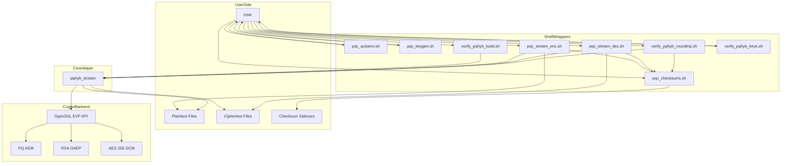
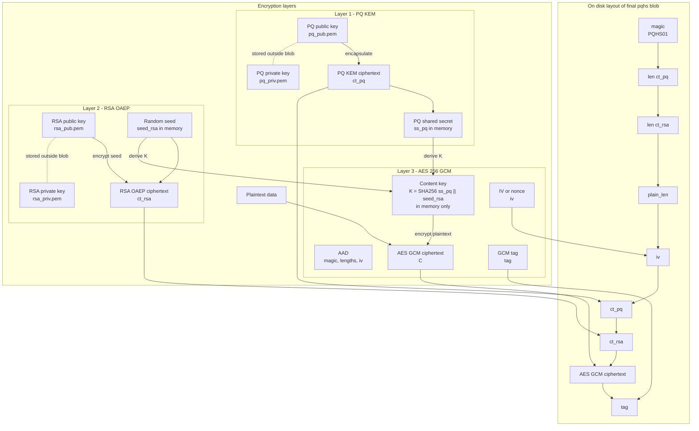

DO NOT USE THIS FOR ANYTHING. I AM STILL ACTIVELY TESTING IT AND TRYING TO BREAK IT

The problem:
- I am using AWS S3 buckets to off-site my borg backup, and I wanted my borg backup data to be more resiliant to to 'store now decrypt later' attacks by Amazon assuming the eventual implementation of quantum codebreaking

The post quantum secure algorithms I am using
- https://csrc.nist.gov/projects/post-quantum-cryptography

The experimental method I am using them with:
- Open SSL experimental version using these algorithms in a block-wise way:
- https://github.com/open-quantum-safe/oqs-provider

The solution:
- So I vibe coded 'something' up with the help of Perplexity and now I'm going to try and break it and find vulnerabilities in the implementation that could be exploited by attackers.

Vibe-coded Doc:


# PQ Hybrid Stream Encryption Toolkit Documentation

This document describes the complete shell-and-C toolkit for hybrid post-quantum file encryption, decryption, checksum validation, build verification, key generation, and end-to-end testing. The toolkit combines a post-quantum KEM through OpenSSL EVP KEM APIs with RSA-OAEP as a second wrapping component and AES-256-GCM for bulk authenticated encryption in the current helper implementation.[cite:1]

The implementation is intended for regular files and operational batch workflows. The current C helper uses a framing design that requires seekable file-backed streams for encryption output and decryption input, so ordinary files and shell redirection to files are supported, while arbitrary unseekable pipe-only workflows are not fully supported by the present helper design.[cite:1]

## Components

The toolkit consists of these main files:

| File | Purpose |
|---|---|
| `pqhyb_stream.c` | C helper implementing hybrid encryption and decryption framing. |
| `pqc_build_helper.sh` | Builds the C helper with OpenSSL development flags. |
| `pqc_autoenv.sh` | Detects OpenSSL/provider settings and exports environment variables. |
| `pqc_keygen.sh` | Generates PQ and RSA key pairs. |
| `pqc_checksums.sh` | Creates, prints, and verifies SHA-256 sidecar files. |
| `pqc_stream_enc.sh` | High-level encryption wrapper with progress and checksum modes. |
| `pqc_stream_dec.sh` | High-level decryption wrapper with progress and checksum modes. |
| `verify_pqhyb_build.sh` | Verifies that the compiled helper is executable and behaves as expected. |
| `verify_pqhyb_keys.sh` | Verifies parseability of PQ and RSA keys. |
| `verify_pqhyb_roundtrip.sh` | End-to-end encryption/decryption validation tool. |

## Architecture

The current helper performs hybrid encryption in three layers. First, it encapsulates a shared secret using a PQ KEM public key; second, it generates a random RSA seed and encrypts that seed with RSA-OAEP; third, it derives an AES-256-GCM content-encryption key from the PQ shared secret and RSA seed via SHA-256 concatenation hashing.[cite:1]

The output file format contains a magic value, PQ ciphertext length, RSA ciphertext length, plaintext length field, IV, PQ ciphertext, RSA ciphertext, AES-GCM ciphertext, and GCM authentication tag. During decryption, the helper reconstructs the AES key from the decapsulated PQ secret and RSA-decrypted seed, then authenticates and decrypts the ciphertext stream.[cite:1]

## Environment setup

### `pqc_autoenv.sh`

This script detects the OpenSSL binary, checks whether `oqsprovider` is visible through `openssl list -providers`, attempts to detect a suitable ML-KEM algorithm name from the runtime, and exports convenience variables.[cite:1]

### Exported variables

| Variable | Meaning |
|---|---|
| `OPENSSL_BIN` | OpenSSL executable to use. |
| `OSSL_PROVIDER_ARGS` | Provider argument string such as `-provider default -provider oqsprovider`. |
| `PQ_KEM_ALG` | Detected PQ KEM name, for example `MLKEM768`. |
| `PQ_KEM_RSA_SUITE` | Human-readable suite label. |

### Examples

Load the default OpenSSL from `PATH`:

```bash
source ./pqc_autoenv.sh
```

Load a specific OpenSSL binary:

```bash
source ./pqc_autoenv.sh /opt/openssl-3.5/bin/openssl
```

Inspect detected values:

```bash
echo "$OPENSSL_BIN"
echo "$OSSL_PROVIDER_ARGS"
echo "$PQ_KEM_ALG"
echo "$PQ_KEM_RSA_SUITE"
```

Use the exported settings in later commands:

```bash
source ./pqc_autoenv.sh
./pqc_keygen.sh \
  --pq-alg "$PQ_KEM_ALG" \
  --out-pq-priv pq_priv.pem --out-pq-pub pq_pub.pem \
  --out-rsa-priv rsa_priv.pem --out-rsa-pub rsa_pub.pem
```

## Building the helper

### `pqc_build_helper.sh`

This script compiles `pqhyb_stream.c` using the system compiler and OpenSSL compile/link flags, preferring `pkg-config` when available.[cite:1]

### Syntax

```bash
./pqc_build_helper.sh [source-file] [output-binary]
```

### Examples

Build with defaults:

```bash
./pqc_build_helper.sh
```

Build from the default source to a custom output name:

```bash
./pqc_build_helper.sh pqhyb_stream.c pqhyb_stream_linux
```

Build with an explicit compiler:

```bash
CC=clang ./pqc_build_helper.sh
```

Build with explicit OpenSSL flags when `pkg-config` is unavailable:

```bash
OPENSSL_CFLAGS='-I/opt/openssl/include' \
OPENSSL_LIBS='-L/opt/openssl/lib -lssl -lcrypto' \
./pqc_build_helper.sh
```

### `verify_pqhyb_build.sh`

This script verifies that the helper binary exists, is executable, resolves dynamic libraries through `ldd` when available, and returns non-zero when run without required arguments.[cite:1]

### Syntax

```bash
./verify_pqhyb_build.sh --bin ./pqhyb_stream
```

### Examples

Basic build verification:

```bash
./verify_pqhyb_build.sh --bin ./pqhyb_stream
```

Verify a custom binary:

```bash
./verify_pqhyb_build.sh --bin ./pqhyb_stream_linux
```

## Key generation and validation

### `pqc_keygen.sh`

This script generates one PQ keypair and one RSA keypair. The PQ algorithm defaults to `PQ_KEM_ALG` when exported or `MLKEM768` otherwise, and RSA defaults to 3072 bits.[cite:1]

### Flags

| Flag | Required | Meaning |
|---|---|---|
| `--pq-alg <name>` | No | PQ KEM algorithm to generate. |
| `--rsa-bits <bits>` | No | RSA key size, default 3072. |
| `--out-pq-priv <file>` | Yes | PQ private key output file. |
| `--out-pq-pub <file>` | Yes | PQ public key output file. |
| `--out-rsa-priv <file>` | Yes | RSA private key output file. |
| `--out-rsa-pub <file>` | Yes | RSA public key output file. |

### Examples

Generate standard keys:

```bash
./pqc_keygen.sh \
  --out-pq-priv pq_priv.pem --out-pq-pub pq_pub.pem \
  --out-rsa-priv rsa_priv.pem --out-rsa-pub rsa_pub.pem
```

Generate using an environment-detected PQ algorithm:

```bash
source ./pqc_autoenv.sh
./pqc_keygen.sh \
  --pq-alg "$PQ_KEM_ALG" \
  --out-pq-priv pq_priv.pem --out-pq-pub pq_pub.pem \
  --out-rsa-priv rsa_priv.pem --out-rsa-pub rsa_pub.pem
```

Generate a larger RSA key:

```bash
./pqc_keygen.sh \
  --pq-alg MLKEM768 \
  --rsa-bits 4096 \
  --out-pq-priv pq_priv.pem --out-pq-pub pq_pub.pem \
  --out-rsa-priv rsa_priv.pem --out-rsa-pub rsa_pub.pem
```

### `verify_pqhyb_keys.sh`

This script confirms that the four key files exist and that OpenSSL can parse them as valid public/private keys.[cite:1]

### Syntax

```bash
./verify_pqhyb_keys.sh \
  --pq-pubkey pq_pub.pem --pq-privkey pq_priv.pem \
  --rsa-pubkey rsa_pub.pem --rsa-privkey rsa_priv.pem
```

### Examples

Verify freshly generated keys:

```bash
./verify_pqhyb_keys.sh \
  --pq-pubkey pq_pub.pem --pq-privkey pq_priv.pem \
  --rsa-pubkey rsa_pub.pem --rsa-privkey rsa_priv.pem
```

Verify keys in another directory:

```bash
./verify_pqhyb_keys.sh \
  --pq-pubkey keys/prod_pq_pub.pem \
  --pq-privkey keys/prod_pq_priv.pem \
  --rsa-pubkey keys/prod_rsa_pub.pem \
  --rsa-privkey keys/prod_rsa_priv.pem
```

## Checksum operations

### `pqc_checksums.sh`

This script manages SHA-256 sidecar files in standard `sha256sum` format. It supports creating new sidecars, verifying existing sidecars, and printing raw hashes without creating sidecars.[cite:1]

### Syntax

```bash
./pqc_checksums.sh create <file> [file...]
./pqc_checksums.sh verify <file.sha256> [file.sha256...]
./pqc_checksums.sh print <file> [file...]
```

### Modes

| Mode | Action |
|---|---|
| `create` | Writes `<file>.sha256`. |
| `verify` | Verifies one or more sidecar files. |
| `print` | Prints hashes to stdout without creating sidecars. |

### Examples

Create a checksum for one file:

```bash
./pqc_checksums.sh create archive.tar
```

Create checksums for several files:

```bash
./pqc_checksums.sh create sample.bin encrypted.pqhs restored.bin
```

Verify a single sidecar:

```bash
./pqc_checksums.sh verify archive.tar.sha256
```

Verify several sidecars:

```bash
./pqc_checksums.sh verify sample.bin.sha256 encrypted.pqhs.sha256 restored.bin.sha256
```

Print a hash without creating a sidecar:

```bash
./pqc_checksums.sh print sample.bin
```

Print several hashes for quick inspection:

```bash
./pqc_checksums.sh print sample.bin sample.bin.pqhs sample.restored
```

## High-level encryption wrapper

### `pqc_stream_enc.sh`

This wrapper drives the `pqhyb_stream` helper in encryption mode. It can use stdin/stdout directly, or it can work with explicit files; when file paths are used, it can also show progress with `pv` and apply checksum policies to the input and output files.[cite:1]

### Syntax

```bash
./pqc_stream_enc.sh \
  --pq-pubkey pq_pub.pem \
  --rsa-pubkey rsa_pub.pem \
  [--bin ./pqhyb_stream] \
  [--input file] [--output file] \
  [--progress] [--dry-run] \
  [--checksum-in MODE] [--checksum-out MODE]
```

### Flags

| Flag | Required | Meaning |
|---|---|---|
| `--bin <path>` | No | Helper binary path, default `./pqhyb_stream`. |
| `--pq-pubkey <file>` | Yes | Recipient PQ public key. |
| `--rsa-pubkey <file>` | Yes | Recipient RSA public key. |
| `--input <file>` | No | Input file instead of stdin. |
| `--output <file>` | No | Output file instead of stdout. |
| `--progress` | No | Uses `pv` for progress display when input is a file. |
| `--dry-run` | No | Prints the command flow instead of executing it. |
| `--checksum-in <mode>` | No | Checksum handling for plaintext input file. |
| `--checksum-out <mode>` | No | Checksum handling for encrypted output file. |

### Checksum mode semantics

| Mode | Meaning |
|---|---|
| `off` | No checksum action. |
| `create` | Create a new sidecar unconditionally. |
| `verify` | Require an existing sidecar and verify it. |
| `auto` | Verify if sidecar exists; otherwise create and verify. |

### Examples

Encrypt from stdin to stdout:

```bash
cat sample.bin | ./pqc_stream_enc.sh \
  --pq-pubkey pq_pub.pem \
  --rsa-pubkey rsa_pub.pem > sample.bin.pqhs
```

Encrypt a file to a file:

```bash
./pqc_stream_enc.sh \
  --pq-pubkey pq_pub.pem \
  --rsa-pubkey rsa_pub.pem \
  --input sample.bin \
  --output sample.bin.pqhs
```

Encrypt with progress:

```bash
./pqc_stream_enc.sh \
  --pq-pubkey pq_pub.pem \
  --rsa-pubkey rsa_pub.pem \
  --input hugefile.dat \
  --output hugefile.dat.pqhs \
  --progress
```

Encrypt with strict plaintext verification and ciphertext sidecar creation:

```bash
./pqc_stream_enc.sh \
  --bin ./pqhyb_stream \
  --pq-pubkey pq_pub.pem \
  --rsa-pubkey rsa_pub.pem \
  --input hugefile.dat \
  --output hugefile.dat.pqhs \
  --progress \
  --checksum-in verify \
  --checksum-out create
```

Encrypt with automatic input sidecar handling and output verification later:

```bash
./pqc_stream_enc.sh \
  --pq-pubkey pq_pub.pem \
  --rsa-pubkey rsa_pub.pem \
  --input archive.tar \
  --output archive.tar.pqhs \
  --checksum-in auto \
  --checksum-out create
```

Show the exact execution plan without running it:

```bash
./pqc_stream_enc.sh \
  --pq-pubkey pq_pub.pem \
  --rsa-pubkey rsa_pub.pem \
  --input sample.bin \
  --output sample.bin.pqhs \
  --progress \
  --checksum-in verify \
  --checksum-out create \
  --dry-run
```

Use a custom helper binary:

```bash
./pqc_stream_enc.sh \
  --bin /usr/local/bin/pqhyb_stream \
  --pq-pubkey pq_pub.pem \
  --rsa-pubkey rsa_pub.pem \
  --input db.dump \
  --output db.dump.pqhs
```

## High-level decryption wrapper

### `pqc_stream_dec.sh`

This wrapper drives the helper in decryption mode and mirrors the encryption wrapper's file, progress, dry-run, and checksum options. It is commonly used to verify ciphertext integrity through sidecars before decryption and to create or verify a sidecar for the restored plaintext output.[cite:1]

### Syntax

```bash
./pqc_stream_dec.sh \
  --pq-privkey pq_priv.pem \
  --rsa-privkey rsa_priv.pem \
  [--bin ./pqhyb_stream] \
  [--input file] [--output file] \
  [--progress] [--dry-run] \
  [--checksum-in MODE] [--checksum-out MODE]
```

### Flags

| Flag | Required | Meaning |
|---|---|---|
| `--bin <path>` | No | Helper binary path, default `./pqhyb_stream`. |
| `--pq-privkey <file>` | Yes | Recipient PQ private key. |
| `--rsa-privkey <file>` | Yes | Recipient RSA private key. |
| `--input <file>` | No | Input encrypted file instead of stdin. |
| `--output <file>` | No | Output plaintext file instead of stdout. |
| `--progress` | No | Uses `pv` for progress display when input is a file. |
| `--dry-run` | No | Prints the command flow instead of executing it. |
| `--checksum-in <mode>` | No | Checksum handling for encrypted input file. |
| `--checksum-out <mode>` | No | Checksum handling for restored output file. |

### Examples

Decrypt from stdin to stdout:

```bash
cat sample.bin.pqhs | ./pqc_stream_dec.sh \
  --pq-privkey pq_priv.pem \
  --rsa-privkey rsa_priv.pem > sample.restored
```

Decrypt file to file:

```bash
./pqc_stream_dec.sh \
  --pq-privkey pq_priv.pem \
  --rsa-privkey rsa_priv.pem \
  --input sample.bin.pqhs \
  --output sample.restored
```

Decrypt with progress:

```bash
./pqc_stream_dec.sh \
  --pq-privkey pq_priv.pem \
  --rsa-privkey rsa_priv.pem \
  --input hugefile.dat.pqhs \
  --output hugefile.dat.restored \
  --progress
```

Decrypt with strict ciphertext verification and restored-file sidecar creation:

```bash
./pqc_stream_dec.sh \
  --bin ./pqhyb_stream \
  --pq-privkey pq_priv.pem \
  --rsa-privkey rsa_priv.pem \
  --input hugefile.dat.pqhs \
  --output hugefile.dat.restored \
  --progress \
  --checksum-in verify \
  --checksum-out create
```

Decrypt with automatic ciphertext sidecar handling:

```bash
./pqc_stream_dec.sh \
  --pq-privkey pq_priv.pem \
  --rsa-privkey rsa_priv.pem \
  --input inbox/message001.pqhs \
  --output inbox/message001.txt \
  --checksum-in auto \
  --checksum-out create
```

Preview execution without running:

```bash
./pqc_stream_dec.sh \
  --pq-privkey pq_priv.pem \
  --rsa-privkey rsa_priv.pem \
  --input sample.bin.pqhs \
  --output sample.restored \
  --progress \
  --checksum-in verify \
  --checksum-out create \
  --dry-run
```

## End-to-end round-trip validation

### `verify_pqhyb_roundtrip.sh`

This script performs a complete encryption and decryption cycle using a source file, temporary encrypted file, and temporary restored file. It reports sizes and SHA-256 values for all three and fails if the restored file hash differs from the original file hash.[cite:1]

### Syntax

```bash
./verify_pqhyb_roundtrip.sh \
  --bin ./pqhyb_stream \
  --pq-pubkey pq_pub.pem --pq-privkey pq_priv.pem \
  --rsa-pubkey rsa_pub.pem --rsa-privkey rsa_priv.pem \
  --input sample.dat \
  [--progress] [--dry-run] [--keep-temp] \
  [--checksum-in MODE] [--checksum-enc MODE] [--checksum-out MODE]
```

### Flags

| Flag | Required | Meaning |
|---|---|---|
| `--bin <path>` | Yes | Helper binary path. |
| `--pq-pubkey <file>` | Yes | PQ public key. |
| `--pq-privkey <file>` | Yes | PQ private key. |
| `--rsa-pubkey <file>` | Yes | RSA public key. |
| `--rsa-privkey <file>` | Yes | RSA private key. |
| `--input <file>` | Yes | Source plaintext file. |
| `--progress` | No | Shows progress through `pv`. |
| `--dry-run` | No | Prints planned commands only. |
| `--keep-temp` | No | Preserves temporary encrypted/restored files. |
| `--checksum-in <mode>` | No | Checksum handling for source input file. |
| `--checksum-enc <mode>` | No | Checksum handling for temporary encrypted file. |
| `--checksum-out <mode>` | No | Checksum handling for temporary restored file. |

### Examples

Minimal round-trip verification:

```bash
./verify_pqhyb_roundtrip.sh \
  --bin ./pqhyb_stream \
  --pq-pubkey pq_pub.pem --pq-privkey pq_priv.pem \
  --rsa-pubkey rsa_pub.pem --rsa-privkey rsa_priv.pem \
  --input sample.dat
```

Round-trip verification with progress:

```bash
./verify_pqhyb_roundtrip.sh \
  --bin ./pqhyb_stream \
  --pq-pubkey pq_pub.pem --pq-privkey pq_priv.pem \
  --rsa-pubkey rsa_pub.pem --rsa-privkey rsa_priv.pem \
  --input large-backup.img \
  --progress
```

Round-trip verification preserving temporary artifacts:

```bash
./verify_pqhyb_roundtrip.sh \
  --bin ./pqhyb_stream \
  --pq-pubkey pq_pub.pem --pq-privkey pq_priv.pem \
  --rsa-pubkey rsa_pub.pem --rsa-privkey rsa_priv.pem \
  --input sample.dat \
  --keep-temp
```

Round-trip verification with strict input verification and sidecar creation for temporary outputs:

```bash
./verify_pqhyb_roundtrip.sh \
  --bin ./pqhyb_stream \
  --pq-pubkey pq_pub.pem --pq-privkey pq_priv.pem \
  --rsa-pubkey rsa_pub.pem --rsa-privkey rsa_priv.pem \
  --input sample.dat \
  --checksum-in verify \
  --checksum-enc create \
  --checksum-out create
```

Round-trip verification with automatic source sidecar handling:

```bash
./verify_pqhyb_roundtrip.sh \
  --bin ./pqhyb_stream \
  --pq-pubkey pq_pub.pem --pq-privkey pq_priv.pem \
  --rsa-pubkey rsa_pub.pem --rsa-privkey rsa_priv.pem \
  --input sample.dat \
  --checksum-in auto \
  --checksum-enc auto \
  --checksum-out auto
```

Dry-run the round-trip test:

```bash
./verify_pqhyb_roundtrip.sh \
  --bin ./pqhyb_stream \
  --pq-pubkey pq_pub.pem --pq-privkey pq_priv.pem \
  --rsa-pubkey rsa_pub.pem --rsa-privkey rsa_priv.pem \
  --input sample.dat \
  --progress \
  --checksum-in verify \
  --checksum-enc create \
  --checksum-out create \
  --dry-run
```

## C helper command-line interface

### `pqhyb_stream`

The helper has two command families: `encrypt` and `decrypt`. It accepts exactly the PQ and RSA key arguments needed for the selected direction, and it reads payload data from stdin and writes output to stdout.[cite:1]

### Syntax

```bash
./pqhyb_stream encrypt --pq-pubkey pq_pub.pem --rsa-pubkey rsa_pub.pem < plaintext > ciphertext
./pqhyb_stream decrypt --pq-privkey pq_priv.pem --rsa-privkey rsa_priv.pem < ciphertext > plaintext
```

### Encryption flags

| Flag | Required | Meaning |
|---|---|---|
| `encrypt` | Yes | Selects encryption mode. |
| `--pq-pubkey <file>` | Yes | PQ public key used for KEM encapsulation. |
| `--rsa-pubkey <file>` | Yes | RSA public key used for OAEP encryption of the seed. |

### Decryption flags

| Flag | Required | Meaning |
|---|---|---|
| `decrypt` | Yes | Selects decryption mode. |
| `--pq-privkey <file>` | Yes | PQ private key used for KEM decapsulation. |
| `--rsa-privkey <file>` | Yes | RSA private key used for OAEP seed recovery. |

### Examples

Encrypt directly with shell redirection:

```bash
./pqhyb_stream encrypt \
  --pq-pubkey pq_pub.pem \
  --rsa-pubkey rsa_pub.pem < sample.bin > sample.bin.pqhs
```

Decrypt directly with shell redirection:

```bash
./pqhyb_stream decrypt \
  --pq-privkey pq_priv.pem \
  --rsa-privkey rsa_priv.pem < sample.bin.pqhs > sample.restored
```

Use in a command chain that still ends in a regular file:

```bash
cat sample.bin | ./pqhyb_stream encrypt \
  --pq-pubkey pq_pub.pem \
  --rsa-pubkey rsa_pub.pem > sample.bin.pqhs
```

Decrypt and immediately hash the restored result:

```bash
./pqhyb_stream decrypt \
  --pq-privkey pq_priv.pem \
  --rsa-privkey rsa_priv.pem < sample.bin.pqhs | sha256sum
```

### Important helper limitation

The current framing design writes the plaintext length back into an earlier header position after encryption and seeks to the GCM tag at the end during decryption. Because of that, encryption requires seekable stdout and decryption requires seekable stdin in the current implementation, which makes ordinary regular files the correct transport target for now.[cite:1]

## Operational patterns

### Recommended strict workflow

This pattern gives clear checkpoints for integrity and repeatability:[cite:1]

1. Create or verify a sidecar for the source plaintext file.
2. Encrypt to a regular output file.
3. Create a sidecar for the encrypted output.
4. Verify the encrypted sidecar before decrypting.
5. Decrypt to a regular restored file.
6. Create a sidecar for the restored output.
7. Compare the original and restored checksums or use the round-trip verifier.

Example:

```bash
./pqc_checksums.sh create source.img
./pqc_stream_enc.sh \
  --pq-pubkey pq_pub.pem --rsa-pubkey rsa_pub.pem \
  --input source.img --output source.img.pqhs \
  --progress --checksum-in verify --checksum-out create
./pqc_stream_dec.sh \
  --pq-privkey pq_priv.pem --rsa-privkey rsa_priv.pem \
  --input source.img.pqhs --output source.restored.img \
  --progress --checksum-in verify --checksum-out create
./pqc_checksums.sh verify source.img.sha256 source.img.pqhs.sha256 source.restored.img.sha256
```

### First-time convenience workflow

This pattern is looser but useful for initial onboarding, where missing sidecars should be created automatically.[cite:1]

```bash
./pqc_stream_enc.sh \
  --pq-pubkey pq_pub.pem --rsa-pubkey rsa_pub.pem \
  --input first-run.dat --output first-run.dat.pqhs \
  --checksum-in auto --checksum-out auto

./pqc_stream_dec.sh \
  --pq-privkey pq_priv.pem --rsa-privkey rsa_priv.pem \
  --input first-run.dat.pqhs --output first-run.restored \
  --checksum-in auto --checksum-out auto
```

### Full validation workflow

```bash
source ./pqc_autoenv.sh
./pqc_build_helper.sh pqhyb_stream.c pqhyb_stream
./verify_pqhyb_build.sh --bin ./pqhyb_stream
./pqc_keygen.sh \
  --pq-alg "$PQ_KEM_ALG" \
  --out-pq-priv pq_priv.pem --out-pq-pub pq_pub.pem \
  --out-rsa-priv rsa_priv.pem --out-rsa-pub rsa_pub.pem
./verify_pqhyb_keys.sh \
  --pq-pubkey pq_pub.pem --pq-privkey pq_priv.pem \
  --rsa-pubkey rsa_pub.pem --rsa-privkey rsa_priv.pem
./verify_pqhyb_roundtrip.sh \
  --bin ./pqhyb_stream \
  --pq-pubkey pq_pub.pem --pq-privkey pq_priv.pem \
  --rsa-pubkey rsa_pub.pem --rsa-privkey rsa_priv.pem \
  --input sample.dat \
  --progress \
  --checksum-in auto \
  --checksum-enc create \
  --checksum-out create
```

## Error behavior and troubleshooting

### Common checksum-mode failures

| Situation | Likely cause | Resolution |
|---|---|---|
| `Missing checksum file` | `verify` mode used before a sidecar was created. | Create the sidecar first or use `auto` for first-run workflows. |
| `Checksum mismatch` | File changed after sidecar creation. | Revalidate the source of truth, regenerate the file if needed, then recreate the sidecar intentionally. |
| `Invalid checksum mode` | Typo such as `verified` or `on`. | Use exactly `off`, `create`, `verify`, or `auto`. |

### Common helper failures

| Situation | Likely cause | Resolution |
|---|---|---|
| `bad magic` | Input is not a valid `.pqhs` file or is corrupted. | Verify the encrypted file and its sidecar, then retry with the correct file. |
| `GCM authentication failed` | Wrong keys, modified ciphertext, or format mismatch. | Confirm the keypair, verify ciphertext sidecar, and ensure the file was produced by the matching helper version. |
| `stdout seek failed` | Encryption output is not a regular seekable file. | Redirect encryption output to a regular file. |
| `stdin must be seekable` | Decryption input is not a seekable regular file. | Supply ciphertext from a regular file. |

## Security and usage notes

The current helper is a hybrid file-encryption helper rather than a pure streaming pipe-native format. It is optimized for controlled file workflows and integrity-checked batch operations rather than unrestricted arbitrary Unix pipelines.[cite:1]

Checksum sidecars add operational file-integrity verification before and after cryptographic processing, but they do not replace AES-GCM authentication. The GCM tag is still the authoritative cryptographic integrity check for the encrypted payload and authenticated metadata during decryption.[cite:1]



```mermaid
flowchart TD

    %% Top level: plaintext and final blob
    P["Plaintext data"]
    B["Encrypted file\n.pqhs blob"]

    %% Layer 1: PQ KEM
    subgraph L1["Layer 1 - PQ KEM"]
        L1_PUB["PQ public key\npq_pub.pem"]
        L1_PRIV["PQ private key\npq_priv.pem"]
        L1_CT["PQ KEM ciphertext\n(ct_pq)"]
        L1_SS["PQ shared secret\nss_pq (in memory)"]
    end

    %% Layer 2: RSA OAEP
    subgraph L2["Layer 2 - RSA OAEP"]
        L2_PUB["RSA public key\nrsa_pub.pem"]
        L2_PRIV["RSA private key\nrsa_priv.pem"]
        L2_SEED["Random seed\nseed_rsa (in memory)"]
        L2_CT["RSA OAEP ciphertext\n(ct_rsa)"]
    end


    %% Layer 3: AES GCM
    subgraph L3["Layer 3 - AES 256 GCM"]
        L3_KEY["Content key\nK = SHA256(ss_pq || seed_rsa)\n(in memory only)"]
        L3_IV["IV / nonce\n(iv)"]
        L3_AAD["Header as AAD\n(magic, lengths, iv)"]
        L3_CT["AES GCM ciphertext\nC = Enc_K(P, iv, aad)"]
        L3_TAG["GCM tag\n(tag)"]
    end

    %% Header layout inside .pqhs blob

    subgraph Layout["On disk layout of .pqhs"]
        H_MAGIC["Magic\n\"PQHS01\""]
        H_L1LEN["len(ct_pq)"]
        H_L2LEN["len(ct_rsa)"]
        H_PLEN["plaintext length"]
        H_IV["iv"]
        H_CT_PQ["ct_pq"]
        H_CT_RSA["ct_rsa"]
        H_CT_STREAM["C (AES GCM ciphertext)"]
        H_TAG["tag"]
    end

    %% Flow of encryption steps
    P -->|"encrypt with K"| L3_CT
    L1_PUB -->|"KEM encapsulate"| L1_CT
    L1_CT --> L1_SS
    L2_PUB -->|"RSA OAEP encrypt"| L2_CT
    L2_SEED --> L2_CT
    L1_SS -->|"derive K with seed_rsa"| L3_KEY
    L2_SEED -->|"derive K with ss_pq"| L3_KEY
    L3_KEY -->|"AES GCM over P"| L3_CT
    L3_CT --> H_CT_STREAM
    L3_IV --> H_IV
    L3_TAG --> H_TAG

    %% Mapping keys to locations
    L1_PUB -. stored in .pem .->|"on disk\noutside blob"| L1_PRIV
    L2_PUB -. stored in .pem .->|"on disk\noutside blob"| L2_PRIV

    %% Building the blob
    H_MAGIC --> B
    H_L1LEN --> B
    H_L2LEN --> B
    H_PLEN --> B
    H_IV --> B
    H_CT_PQ --> B
    H_CT_RSA --> B
    H_CT_STREAM --> B
    H_TAG --> B

    %% PQ and RSA ciphertexts embedded in header region
    L1_CT --> H_CT_PQ
```

### How to read this

- Key files on disk (outside the blob)
- pq_pub.pem, pq_priv.pem, rsa_pub.pem, and rsa_priv.pem are stored as separate PEM files, not inside the .pqhs blob. They are shown in Layer 1 and Layer 2 nodes with “on disk outside blob” dashed arrows.


#### Inside the encrypted blob

The final .pqhs file contains, in order:
- magic (PQHS01)
- len(ct_pq) (length of the PQ KEM ciphertext)
- len(ct_rsa) (length of the RSA OAEP ciphertext)
- plaintext length
- iv (AES-GCM nonce)
- ct_pq (PQ KEM ciphertext)
- ct_rsa (RSA OAEP ciphertext)
- C (AES-256-GCM ciphertext of the payload)
- tag (GCM authentication tag).


#### Ephemeral secrets in memory only

- ss_pq (PQ shared secret) from KEM decapsulation.
- seed_rsa (random RSA seed).
- K (AES-256 key derived as SHA256 of ss_pq || seed_rsa).
none of these are written to disk; they exist only in process memory during encryption/decryption.

## PQ Hybrid Encryption Mermaid Diagrams

### Architecture and blob composition



## Encryption sequence

```mermaid
sequenceDiagram
    autonumber
    actor U as User
    participant I as Plaintext File
    participant H as pqhyb_stream
    participant PQ as PQ KEM
    participant R as RSA OAEP
    participant K as Key Derivation
    participant A as AES 256 GCM
    participant F as Encrypted File pqhs

    U->>H: encrypt with pq_pub.pem and rsa_pub.pem
    H->>PQ: encapsulate with pq_pub.pem
    PQ-->>H: ct_pq and ss_pq

    H->>R: generate random seed_rsa
    H->>R: encrypt seed_rsa with rsa_pub.pem
    R-->>H: ct_rsa

    H->>K: derive K = SHA256 ss_pq || seed_rsa
    K-->>H: AES key

    H->>H: generate iv
    H->>F: write header placeholder

    H->>I: read plaintext stream
    I-->>H: plaintext bytes

    H->>A: initialize with K and iv
    H->>A: set AAD from header
    H->>A: encrypt plaintext stream
    A-->>H: ciphertext bytes and tag

    H->>F: write ct_pq
    H->>F: write ct_rsa
    H->>F: write AES ciphertext
    H->>F: patch plain_len in header
    H->>F: append tag
    F-->>U: encrypted blob ready

    Note over PQ,R,K: ss_pq, seed_rsa, and K stay in memory only
```

## Decryption sequence

```mermaid
sequenceDiagram
    autonumber
    actor U as User
    participant F as Encrypted File pqhs
    participant H as pqhyb_stream
    participant PQ as PQ KEM
    participant R as RSA OAEP
    participant K as Key Derivation
    participant A as AES 256 GCM
    participant O as Output Plaintext File

    U->>H: decrypt with pq_priv.pem and rsa_priv.pem
    H->>F: read header
    F-->>H: magic, len ct_pq, len ct_rsa, plain_len, iv

    H->>F: read ct_pq
    F-->>H: PQ ciphertext

    H->>F: read ct_rsa
    F-->>H: RSA ciphertext

    H->>F: seek to end and read tag
    F-->>H: GCM tag

    H->>F: read AES ciphertext stream
    F-->>H: encrypted payload bytes

    H->>PQ: decapsulate ct_pq with pq_priv.pem
    PQ-->>H: ss_pq

    H->>R: decrypt ct_rsa with rsa_priv.pem
    R-->>H: seed_rsa

    H->>K: derive K = SHA256 ss_pq || seed_rsa
    K-->>H: AES key

    H->>A: initialize with K and iv
    H->>A: set AAD from header
    H->>A: decrypt ciphertext stream
    H->>A: verify tag

    alt authentication passes
        A-->>H: plaintext bytes
        H->>O: write restored plaintext
        O-->>U: restored file ready
    else authentication fails
        A-->>H: error
        H-->>U: GCM authentication failed
    end

    Note over PQ,R,K: ss_pq, seed_rsa, and K exist only in memory
```
