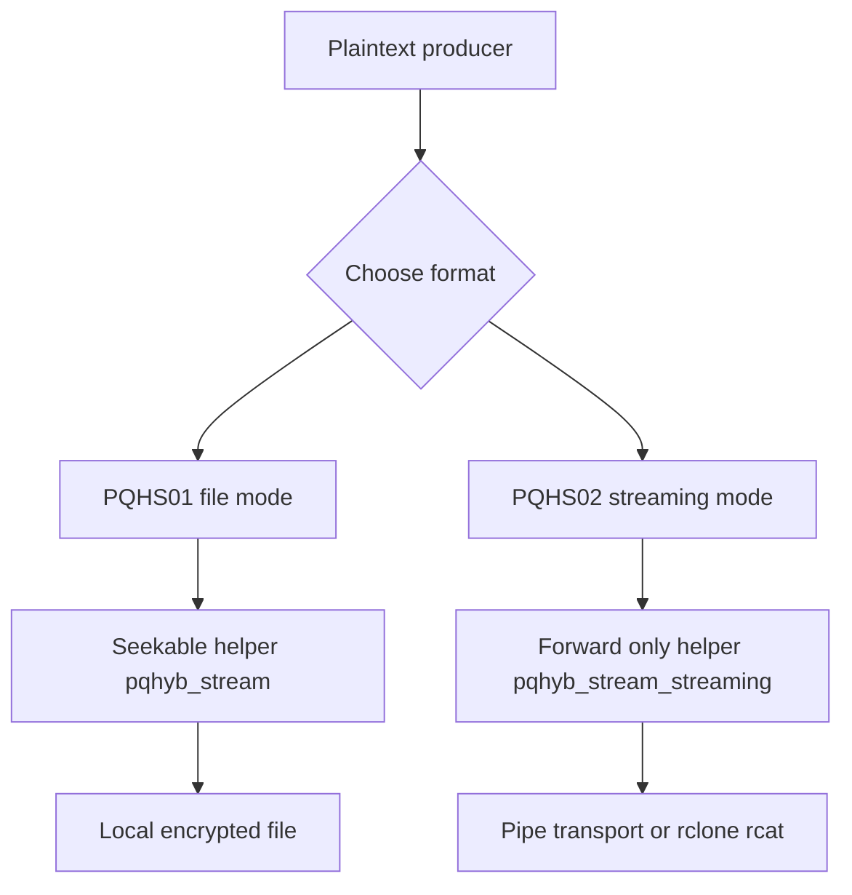
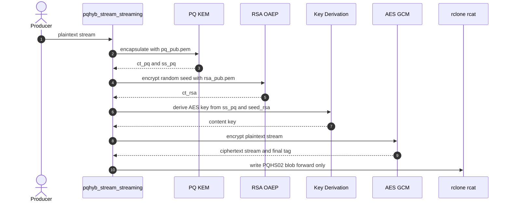
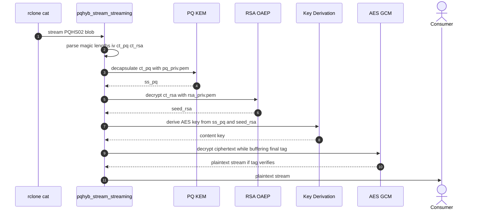

# PQ Hybrid Encryption Mermaid Diagrams

## File mode and streaming mode

```mermaid
flowchart TD
    A[Plaintext producer] --> B{Choose format}
    B --> C[PQHS01 file mode]
    B --> D[PQHS02 streaming mode]
    C --> E[Seekable helper pqhyb_stream]
    D --> F[Forward only helper pqhyb_stream_streaming]
    E --> G[Local encrypted file]
    F --> H[Pipe transport or rclone rcat]
```

## PQHS02 streaming blob layout

```mermaid
flowchart LR
    M[magic] --> L1[len ct_pq]
    L1 --> L2[len ct_rsa]
    L2 --> IV[iv]
    IV --> PQC[ct_pq]
    PQC --> RSAC[ct_rsa]
    RSAC --> C[AES GCM ciphertext]
    C --> T[tag]
```

## PQHS02 encryption sequence

```mermaid
sequenceDiagram
    autonumber
    actor U as Producer
    participant H as pqhyb_stream_streaming
    participant PQ as PQ KEM
    participant R as RSA OAEP
    participant K as Key Derivation
    participant A as AES GCM
    participant RC as rclone rcat

    U->>H: plaintext stream
    H->>PQ: encapsulate with pq_pub.pem
    PQ-->>H: ct_pq and ss_pq
    H->>R: encrypt random seed with rsa_pub.pem
    R-->>H: ct_rsa
    H->>K: derive AES key from ss_pq and seed_rsa
    K-->>H: content key
    H->>A: encrypt plaintext stream
    A-->>H: ciphertext stream and final tag
    H->>RC: write PQHS02 blob forward only
```

## PQHS02 decryption sequence

```mermaid
sequenceDiagram
    autonumber
    participant RC as rclone cat
    participant H as pqhyb_stream_streaming
    participant PQ as PQ KEM
    participant R as RSA OAEP
    participant K as Key Derivation
    participant A as AES GCM
    actor C as Consumer

    RC->>H: stream PQHS02 blob
    H->>H: parse magic lengths iv ct_pq ct_rsa
    H->>PQ: decapsulate ct_pq with pq_priv.pem
    PQ-->>H: ss_pq
    H->>R: decrypt ct_rsa with rsa_priv.pem
    R-->>H: seed_rsa
    H->>K: derive AES key from ss_pq and seed_rsa
    K-->>H: content key
    H->>A: decrypt ciphertext while buffering final tag
    A-->>H: plaintext stream if tag verifies
    H->>C: plaintext stream
```
